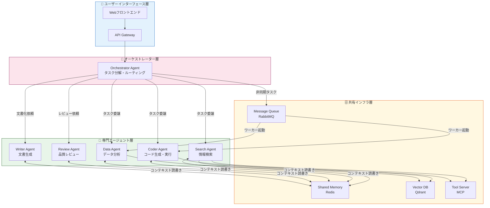
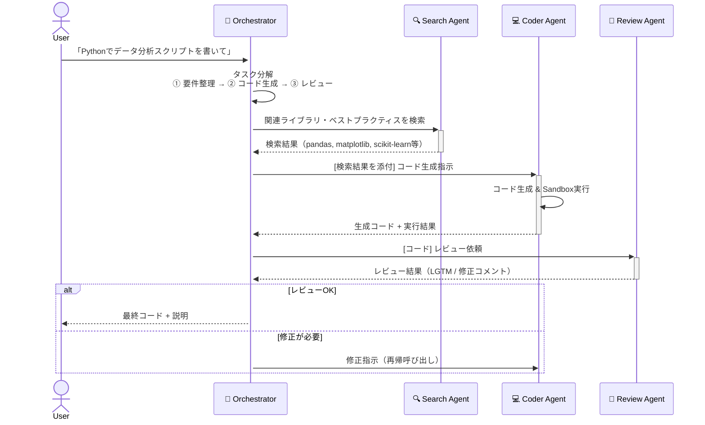
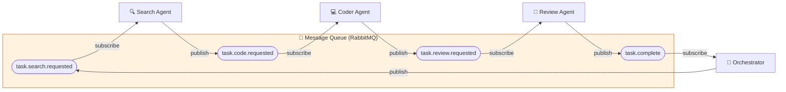
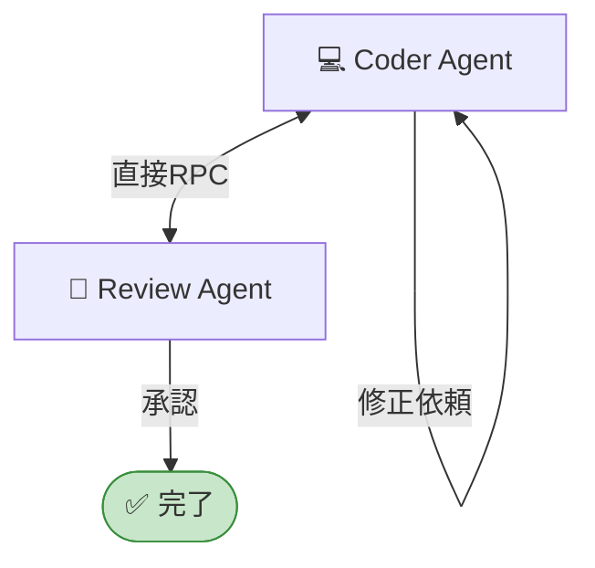
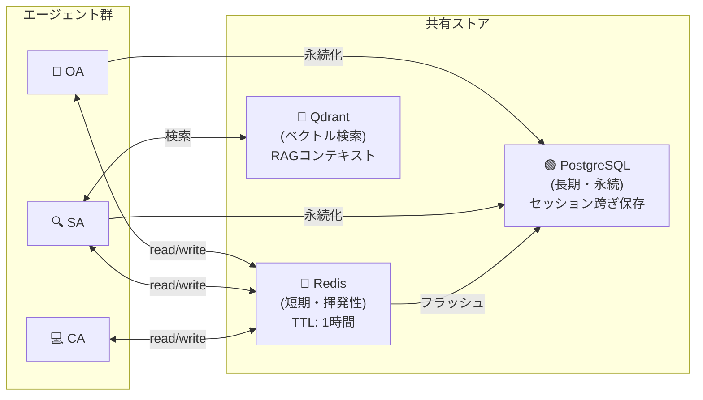
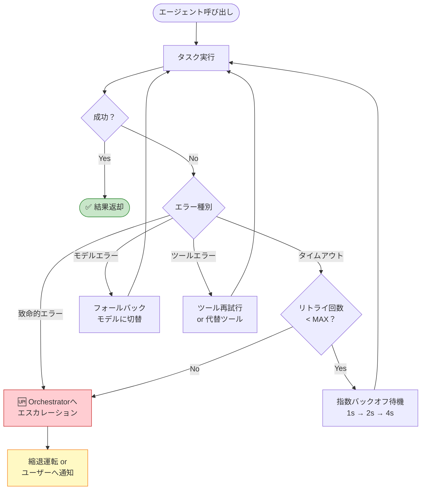
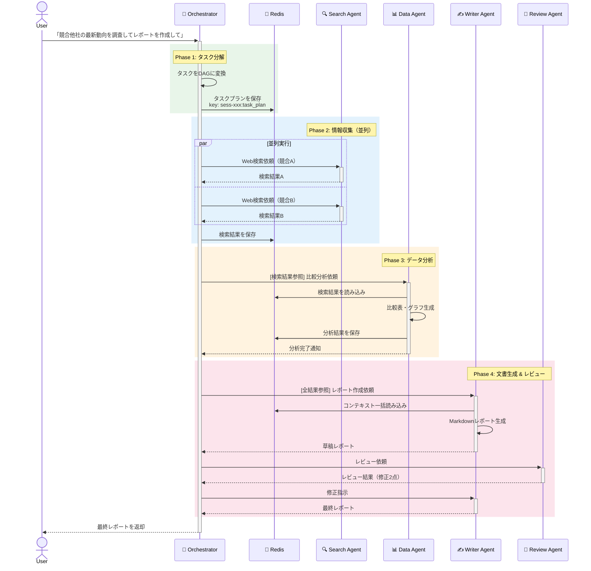
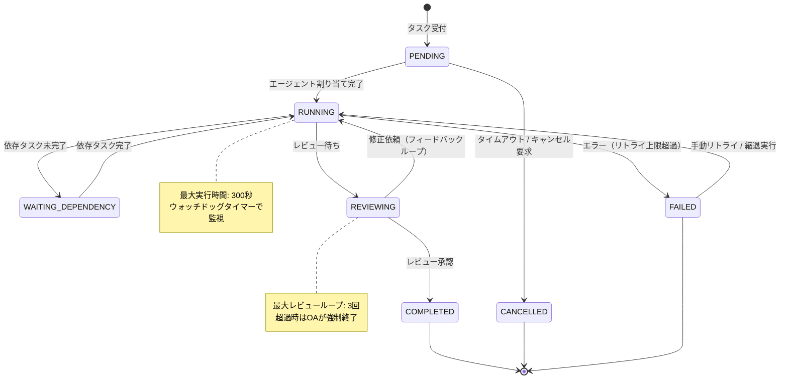
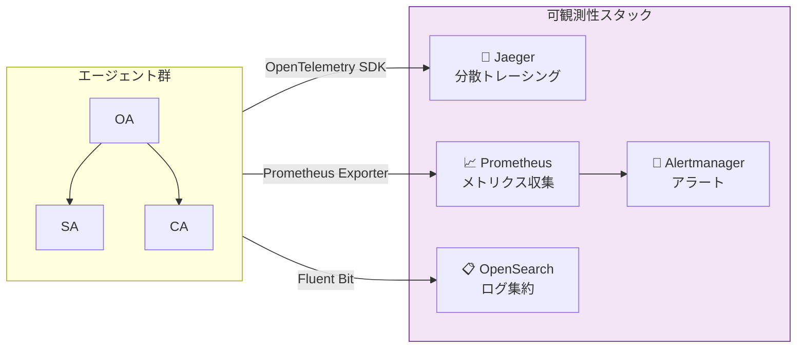

# 1.4.10 エージェント間連携方式

---

## 目次

- [1. 概要](#1-概要)
- [2. 連携アーキテクチャ全体像](#2-連携アーキテクチャ全体像)
- [3. エージェント種別と役割](#3-エージェント種別と役割)
- [4. 連携パターン](#4-連携パターン)
  - [4.1 オーケストレーター型](#41-オーケストレーター型)
  - [4.2 コレオグラフィー型（イベント駆動）](#42-コレオグラフィー型イベント駆動)
  - [4.3 ピアツーピア型](#43-ピアツーピア型)
- [5. メッセージプロトコル](#5-メッセージプロトコル)
- [6. コンテキスト共有方式](#6-コンテキスト共有方式)
- [7. エラーハンドリング・リトライ方式](#7-エラーハンドリングリトライ方式)
- [8. 制御フロー詳細シーケンス](#8-制御フロー詳細シーケンス)
- [9. 状態管理](#9-状態管理)
- [10. 非機能要件対応](#10-非機能要件対応)

---

## 1. 概要

本章では、マルチエージェントシステムにおけるエージェント間の連携方式について定義する。
各エージェントは独立したLLMコンテキストと専門的な役割を持ち、協調して複雑なタスクを達成する。

| 項目 | 内容 |
|------|------|
| **対象システム** | AIアシスタント基盤（マルチエージェント構成） |
| **連携方式** | オーケストレーター型 ＋ イベント駆動型の複合構成 |
| **通信プロトコル** | 内部バス（同期）/ メッセージキュー（非同期） |
| **コンテキスト共有** | 共有メモリ（Redis） + エージェント固有メモリ |
| **採用フレームワーク** | LangGraph / AutoGen（用途に応じて使い分け） |

---

## 2. 連携アーキテクチャ全体像



---

## 3. エージェント種別と役割

| エージェント名 | 略称 | 主な役割 | 使用LLM | 連携先 |
|---|---|---|---|---|
| Orchestrator Agent | OA | タスク分解・委譲・結果集約 | GPT-4o | 全エージェント |
| Search Agent | SA | Web/DB/社内文書検索 | GPT-4o-mini | DA, WA |
| Coder Agent | CA | コード生成・実行・デバッグ | Claude 3.5 Sonnet | RA, DA |
| Data Agent | DA | データ処理・統計・可視化 | GPT-4o | WA, RA |
| Review Agent | RA | 成果物の品質レビュー・修正提案 | GPT-4o | OA（フィードバック） |
| Writer Agent | WA | レポート・ドキュメント生成 | Claude 3.5 Sonnet | OA（最終成果物） |

### エージェント責務の詳細

- **Orchestrator Agent**
  - ユーザーリクエストを受け取り、サブタスクへ分解（Task Decomposition）
  - 依存関係を解析し、実行順序を決定（DAG構築）
  - 各エージェントの結果を収集・統合し、最終回答を生成

- **Search Agent**
  - RAGパイプラインを通じた関連ドキュメント取得
  - Web検索ツール（Bing API / Tavily）の呼び出し
  - 検索結果のスコアリングと要約

- **Coder Agent**
  - コードインタープリター（Python Sandbox）による安全な実行
  - テスト生成・実行によるコード検証
  - 実行結果をStructured Outputとして返却

---

## 4. 連携パターン

### 4.1 オーケストレーター型

中央集権的に OA がすべての制御を担うパターン。複雑なワークフローに適する。



---

### 4.2 コレオグラフィー型（イベント駆動）

エージェントがイベントを購読し、自律的に連鎖するパターン。疎結合・スケーラブル。



#### イベントスキーマ定義

```json
{
  "event_id": "uuid-v4",
  "event_type": "task.code.requested",
  "source_agent": "orchestrator",
  "target_agent": "coder",
  "timestamp": "2026-07-03T10:00:00Z",
  "correlation_id": "session-uuid",
  "payload": {
    "task_id": "task-001",
    "instruction": "データ分析スクリプトを生成してください",
    "context_keys": ["search_result_001", "user_requirements"],
    "priority": "normal",
    "timeout_sec": 60
  }
}
```

---

### 4.3 ピアツーピア型

特定のエージェントペアが直接通信するパターン。低レイテンシが求められる場面で使用。



---

## 5. メッセージプロトコル

エージェント間のメッセージは統一フォーマットで送受信する。

### メッセージ構造

| フィールド | 型 | 必須 | 説明 |
|---|---|---|---|
| `message_id` | UUID | ✅ | メッセージ一意識別子 |
| `correlation_id` | UUID | ✅ | セッション・タスクの追跡用ID |
| `sender` | string | ✅ | 送信エージェントID |
| `receiver` | string | ✅ | 受信エージェントID（`broadcast`も可） |
| `message_type` | enum | ✅ | `request` / `response` / `event` / `error` |
| `priority` | enum | ✅ | `high` / `normal` / `low` |
| `payload` | object | ✅ | メッセージ本文（タスク依存） |
| `context_refs` | array | - | 参照する共有メモリのキー一覧 |
| `created_at` | ISO8601 | ✅ | 送信日時 |
| `expires_at` | ISO8601 | - | メッセージ有効期限 |

### メッセージタイプ詳細

| タイプ | 通信方式 | 用途 | 応答要否 |
|---|---|---|---|
| `request` | 同期 / 非同期 | タスク委譲・ツール呼び出し要求 | ✅ 必要 |
| `response` | 同期 / 非同期 | requestへの応答・成果物返却 | ❌ 不要 |
| `event` | 非同期（Pub/Sub） | 状態変化の通知 | ❌ 不要 |
| `error` | 同期 / 非同期 | エラー・例外の通知 | ❌ 不要 |

---

## 6. コンテキスト共有方式

エージェントは独立したLLMコンテキストを持つため、情報共有は外部ストアを経由する。



### コンテキストキー命名規則

```
{session_id}:{task_id}:{agent_id}:{data_type}

例）
sess-abc123:task-001:search-agent:search_results
sess-abc123:task-001:coder-agent:generated_code
sess-abc123:task-001:orchestrator:task_plan
```

---

## 7. エラーハンドリング・リトライ方式



### リトライポリシー

| エラー種別 | リトライ | 最大回数 | バックオフ | フォールバック |
|---|---|---|---|---|
| ネットワークタイムアウト | ✅ | 3回 | 指数（1s, 2s, 4s） | - |
| LLMレート制限（429） | ✅ | 5回 | 指数 + Jitter | 別エンドポイント |
| LLMモデルエラー（5xx） | ✅ | 2回 | 固定（2s） | フォールバックモデル |
| 入力バリデーションエラー | ❌ | - | - | Orchestratorへ通知 |
| コンテキスト長超過 | ❌ | - | - | チャンク分割して再実行 |

---

## 8. 制御フロー詳細シーケンス

複合タスク（「競合他社の最新動向を調査してレポートを作成せよ」）の完全な実行フロー。



---

## 9. 状態管理

各タスクの実行状態はステートマシンで管理する。



---

## 10. 非機能要件対応

### パフォーマンス要件

| 指標 | 目標値 | 計測方法 |
|---|---|---|
| エージェント間メッセージ遅延 | < 100ms（同期） | APM（Datadog） |
| 非同期タスクキュー遅延 | < 500ms（通常負荷時） | RabbitMQ Management UI |
| コンテキスト読み書き（Redis） | < 10ms | Redis INFO stats |
| タスク全体完了時間（標準） | < 30秒 | トレースID追跡 |

### 可観測性



#### 必須の計装ポイント

- **分散トレース**: 全エージェント呼び出しに `trace_id` / `span_id` を付与し、Jaegerで可視化
- **メトリクス**: タスク成功率・失敗率・レイテンシをPrometheusで収集
- **ログ**: 構造化ログ（JSON）で出力し、`correlation_id` で横断検索可能にする

### セキュリティ

| 脅威 | 対策 |
|---|---|
| プロンプトインジェクション | ユーザー入力のサニタイズ + Guardrailsによる出力検証 |
| エージェント間なりすまし | 内部認証トークン（JWT）による送信元検証 |
| 機密情報の漏洩 | PII検出フィルター（Microsoft Presidio）をパイプラインに組み込み |
| 不正ツール呼び出し | ツール実行権限をエージェントごとにRBACで制限 |

---

> **📝 レビュー記録** ([1.4.14 レビュー](./1.4.14_レビュー.md) 参照)
>
> **📝 修正記録** ([1.4.15 レビュー後修正](./1.4.15_レビュー後修正.md) 参照)
