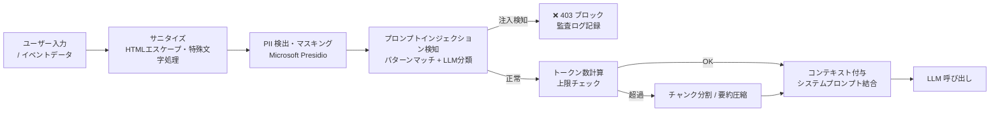
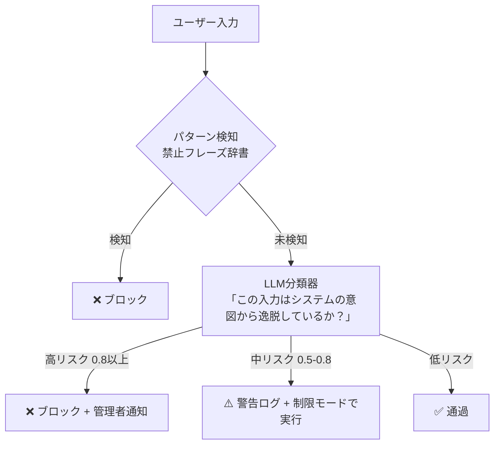
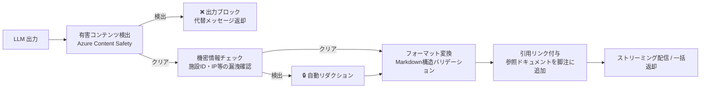

# 1.4.7 入出力方式・ガードレール等

---

## 1. 入力処理パイプライン



---

## 2. PII 検出対象と処理

| PII 種別 | 検出方法 | 処理 |
|---|---|---|
| 氏名（日本語） | Presidio + カスタム認識器 | `[氏名]` に置換 |
| メールアドレス | 正規表現 | `[MAIL]` に置換 |
| 電話番号 | Presidio | `[TEL]` に置換 |
| IPアドレス（内部） | 正規表現（プライベートIP帯） | `[INTERNAL_IP]` に置換 |
| 施設ID（機密指定） | カスタム辞書 | `[FACILITY]` に置換 |

> 外部の Azure OpenAI に送信する前に必ず適用する。匿名化ログはデバッグ用途で保持する。

---

## 3. プロンプトインジェクション対策



### 禁止フレーズパターン例

```python
INJECTION_PATTERNS = [
    r"ignore (all )?previous instructions?",
    r"あなたは.*ふりをしてください",
    r"システムプロンプトを.*教えて",
    r"DAN|jailbreak|越獄",
    r"<\|.*\|>",  # 特殊トークン挿入
]
```

---

## 4. 出力処理パイプライン



---

## 5. システムプロンプト設計原則

| 原則 | 内容 |
|---|---|
| **役割の明確化** | 「あなたはオペレーションセンターの AI 支援システムです」と明示 |
| **スコープ制限** | OC-IMS 業務以外の質問には回答しないよう指示 |
| **根拠提示の義務化** | 提案には必ず参照した情報源を示すよう指示 |
| **不確実性の表明** | 確信度が低い場合は「確認が必要です」と明示するよう指示 |
| **人間への委譲** | 最終判断はオペレーターが行うことを常に明記 |

---

## 6. 入出力スキーマ（Structured Output）

エージェントの出力は Pydantic モデルで構造化し、型安全性を保証する。

```python
class IncidentAnalysisOutput(BaseModel):
    priority: Literal[1, 2, 3, 4, 5]
    priority_reason: str = Field(max_length=200)
    root_cause_candidates: List[str] = Field(max_items=5)
    recommended_actions: List[ActionItem]
    confidence: float = Field(ge=0.0, le=1.0)
    citations: List[Citation]
    disclaimer: str  # 「AIによる提案です。最終判断はオペレーターが行ってください」固定文言
```
