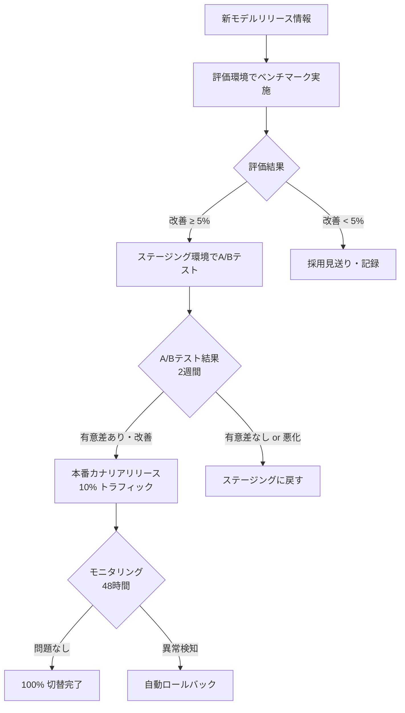
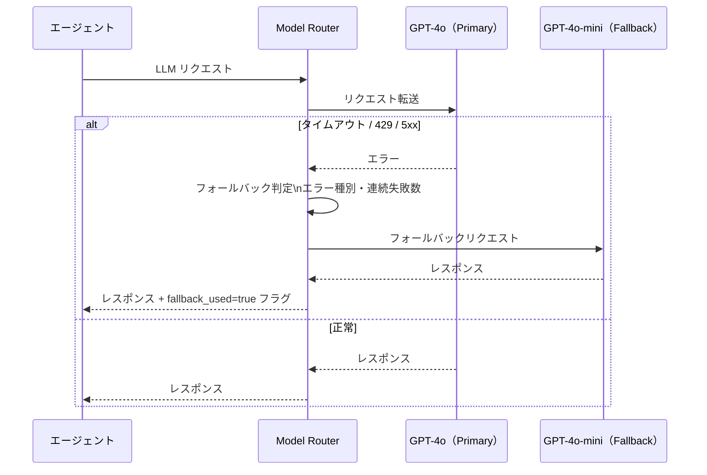

# 1.4.8 モデル管理・モデル切替方式

---

## 1. モデル管理方針

LLM モデルは**設定ファイルで管理**し、コード変更なしに切替可能にする。
新モデルの評価・切替はステージング環境で検証してから本番適用する。

---

## 2. モデル設定管理

```yaml
# model_config.yaml（ConfigMap 管理）
models:
  incident_analysis:
    provider: azure_openai
    deployment: gpt-4o-2024-11-20
    fallback_deployment: gpt-4o-mini-2024-07-18
    max_tokens: 2048
    temperature: 0.1          # 再現性重視（低温度）
    timeout_sec: 30

  knowledge_search:
    provider: azure_openai
    deployment: gpt-4o-mini-2024-07-18
    max_tokens: 1024
    temperature: 0.3
    timeout_sec: 15

  embedding:
    provider: azure_openai
    deployment: text-embedding-3-large
    dimensions: 3072
```

---

## 3. モデルバージョン管理フロー



---

## 4. フォールバックモデル切替



---

## 5. モデル評価指標

| 指標 | 測定方法 | 目標値 |
|---|---|---|
| **回答品質スコア** | LLM-as-a-Judge（GPT-4o による採点） | ≥ 4.0 / 5.0 |
| **Faithfulness** | RAGAs フレームワーク | ≥ 0.85 |
| **Answer Relevancy** | RAGAs | ≥ 0.80 |
| **レイテンシ（p95）** | Prometheus | < 5,000ms |
| **コスト（per request）** | トークン数 × 単価 | < ¥2.0 / リクエスト |

---

## 6. モデル使用状況モニタリング

```mermaid
graph LR
    AGENT[エージェント] -->|OpenTelemetry メトリクス| PROM[Prometheus]
    PROM --> GRAFANA[Grafana Dashboard]
    PROM --> AM[Alertmanager]

    subgraph METRICS["収集メトリクス"]
        M1[llm_request_total{model, status}]
        M2[llm_tokens_total{model, type}]
        M3[llm_latency_seconds{model}]
        M4[llm_cost_usd_total{model}]
    end

    METRICS --> PROM

    AM -->|コスト上限超過| ALERT[Teams 通知]
```
