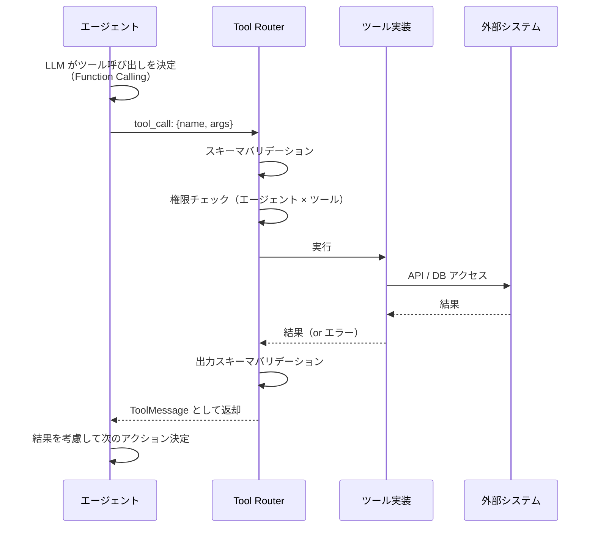

# 1.4.9 ツール利用方式

---

## 1. ツール設計方針

エージェントが利用するツールは以下の原則で設計する。

- **最小権限**: ツールは必要最小限の操作のみ実行できる
- **冪等性**: 同じパラメータで何度呼び出しても同じ結果を返す（状態変更ツールを除く）
- **型安全**: 入出力スキーマを Pydantic で定義し、LLM への説明も自動生成
- **タイムアウト**: すべてのツールに実行タイムアウトを設定する

---

## 2. 利用可能ツール一覧

| ツール名 | 説明 | 利用エージェント | タイムアウト |
|---|---|---|---|
| `search_knowledge_base` | ナレッジベース・過去インシデントをベクトル検索 | Knowledge Agent | 5秒 |
| `get_incident_detail` | インシデントの詳細情報・対応ログを取得 | Incident Analyzer, Summary | 3秒 |
| `get_sensor_metrics` | 指定施設・時間帯のセンサーデータを取得 | Triage, Incident Analyzer | 5秒 |
| `get_alert_history` | 同一設備の過去アラート履歴を取得 | Triage, Incident Analyzer | 3秒 |
| `search_procedure_docs` | 運用手順書・マニュアルを全文検索 | Knowledge Agent | 5秒 |
| `create_incident_note` | インシデントに作業メモを追記する（書き込み） | Summary Agent | 3秒 |
| `escalate_incident` | インシデントのエスカレーションを実行（書き込み） | Triage Agent | 3秒 |

---

## 3. ツール定義例（LangChain 形式）

```python
from langchain_core.tools import tool
from pydantic import BaseModel, Field

class KnowledgeSearchInput(BaseModel):
    query: str = Field(description="検索クエリ（日本語）")
    top_k: int = Field(default=5, ge=1, le=20, description="取得件数")
    filter_tags: list[str] = Field(default=[], description="絞り込みタグ（例: ['電源', '通信']）")

@tool("search_knowledge_base", args_schema=KnowledgeSearchInput)
def search_knowledge_base(query: str, top_k: int = 5, filter_tags: list[str] = []) -> list[dict]:
    """
    過去のインシデント事例・運用ナレッジベースをセマンティック検索します。
    インシデントの原因調査・対応手順の参照に使用してください。
    """
    results = qdrant_client.search(
        collection_name="oc_ims_knowledge",
        query_vector=embed(query),
        query_filter=build_filter(filter_tags),
        limit=top_k,
    )
    return [{"id": r.id, "title": r.payload["title"],
             "summary": r.payload["summary"], "score": r.score}
            for r in results]
```

---

## 4. ツール実行フロー



---

## 5. ツール権限マトリックス

| ツール | Triage | Incident Analyzer | Knowledge | Summary |
|---|---|---|---|---|
| `search_knowledge_base` | ✅ | ✅ | ✅ | ✅ |
| `get_incident_detail` | ✅ | ✅ | - | ✅ |
| `get_sensor_metrics` | ✅ | ✅ | - | - |
| `get_alert_history` | ✅ | ✅ | - | - |
| `search_procedure_docs` | - | ✅ | ✅ | - |
| `create_incident_note` | - | - | - | ✅ |
| `escalate_incident` | ✅ | - | - | - |

---

## 6. ツールエラー処理

| エラー種別 | 対処 |
|---|---|
| タイムアウト | エラーメッセージをエージェントに返却し、別手段（代替ツール等）を試みる |
| スキーマバリデーションエラー | LLM に引数修正を要求（最大2回） |
| 権限エラー | 即時エラー返却・エスカレーション |
| 外部サービス障害 | キャッシュ結果を返却（存在する場合）、存在しない場合は「情報取得不可」を通知 |
