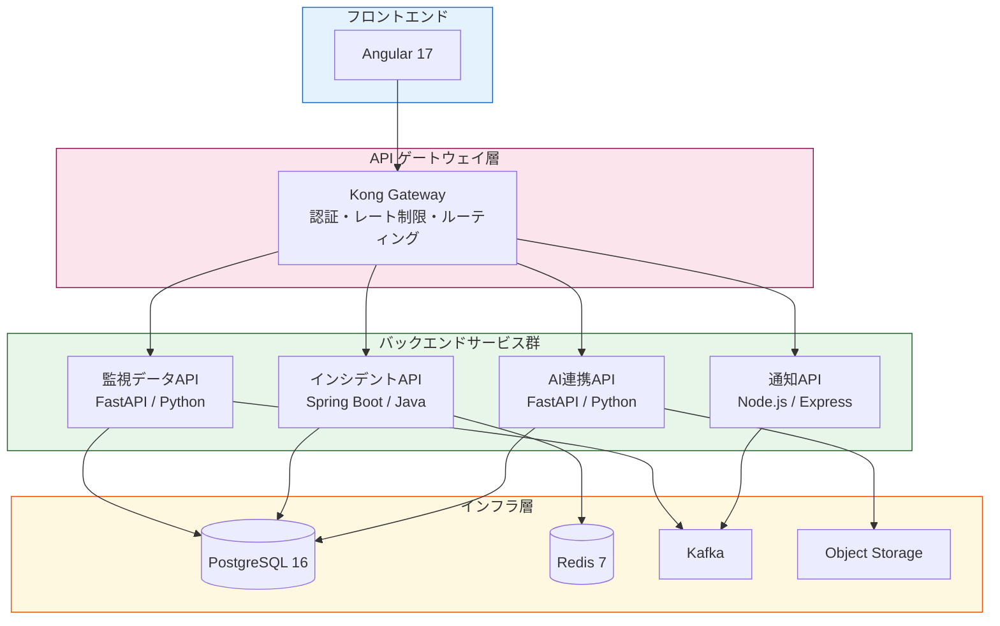

# 1.3.1 アーキテクチャ方針

---

## 対象システム概要

**システム名**: オペレーションセンター統合監視システム（OC-IMS）
**目的**: 社会インフラ施設（電力・通信・交通）の監視データをリアルタイム収集し、異常検知・インシデント対応を支援する

---

## 1. 基本方針

| 方針 | 内容 | 採用理由 |
|---|---|---|
| **APIファースト** | UIより先にAPI仕様を確定する | フロント・モバイル・外部連携の並行開発を可能にする |
| **マイクロサービス** | 機能単位でサービスを分割する | 高可用性・独立デプロイ・障害局所化 |
| **ステートレス設計** | APIサーバはセッション状態を持たない | 水平スケールを容易にする |
| **イベント駆動** | 非同期処理はイベントバスを経由する | 監視データの大量受信に対応 |
| **クラウドネイティブ** | コンテナ + Kubernetes で運用する | 弾力的スケーリング・運用自動化 |

---

## 2. 設計原則

### 2.1 12-Factor App 準拠

| Factor | 適用内容 |
|---|---|
| Codebase | GitHub モノレポ（サービスごとにディレクトリ分割） |
| Dependencies | pip / npm の `requirements.txt` / `package-lock.json` で固定 |
| Config | 環境変数で注入（Kubernetes Secrets / ConfigMap） |
| Backing services | DB・Redis・MQ はアタッチドリソースとして扱う |
| Processes | アプリはステートレスプロセスとして動作する |
| Port binding | 各サービスはポートをバインドして自己完結する |
| Logs | stdout/stderr にストリーム出力、収集は外部に委ねる |

### 2.2 API設計原則

- **RESTful**: URI はリソースを表す名詞、操作は HTTP メソッドで表現
- **バージョニング**: URI パスにバージョンを含める（`/api/v1/...`）
- **冪等性**: PUT・DELETE は冪等に設計する
- **HATEOAS**: 主要なレスポンスにリソースリンクを含める（一部適用）

---

## 3. 技術スタック方針

---

## 4. 非機能要件方針

| 観点 | 目標値 | 対策 |
|---|---|---|
| **可用性** | 99.9%（年間ダウン 8.7h 以内） | Active-Active 冗長構成 |
| **性能** | APIレスポンス p95 < 300ms | キャッシュ・コネクションプール最適化 |
| **スケーラビリティ** | 通常比 10 倍のスパイクに対応 | HPA（Horizontal Pod Autoscaler） |
| **セキュリティ** | OWASP Top 10 対策済み | WAF・入力バリデーション・最小権限 |
| **監視容易性** | MTTD < 5分 | OpenTelemetry + Grafana Stack |

---

## 5. 制約・前提

- 外部監視機器との接続は既存 OPC-UA / SNMP プロトコルを利用する
- レガシー設備管理システムとの連携は REST API ラッパー経由とする
- データ保持ポリシー: 生データ 90日、集計データ 3年
