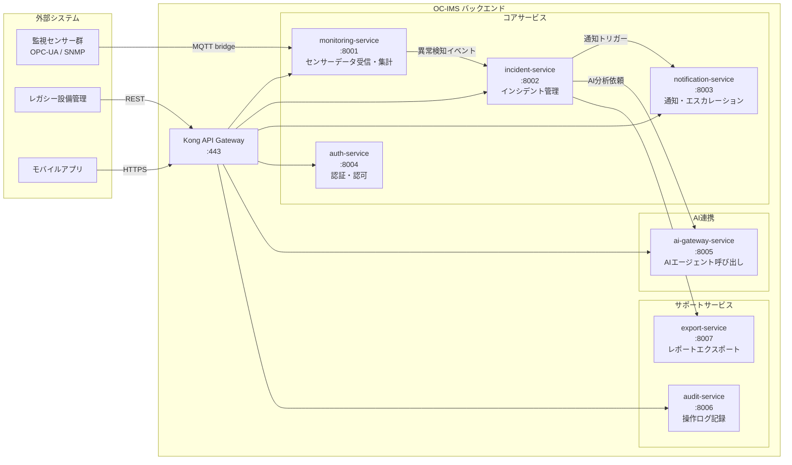
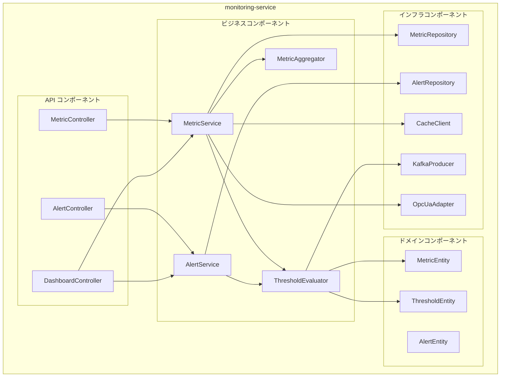

# 1.3.2 アーキテクチャ構成（レイヤ、サービス、コンポーネント、モジュール等）

---

## 1. レイヤ構成

```mermaid
graph TB
    subgraph PRESENTATION["プレゼンテーション層"]
        CTL[Controller<br/>@RestController<br/>リクエスト受付・バリデーション・レスポンス整形]
    end

    subgraph APPLICATION["アプリケーション層"]
        SVC[Service<br/>@Service<br/>ビジネスロジック・トランザクション管理]
        USECASE[UseCase<br/>ユースケース単位の処理オーケストレーション]
    end

    subgraph DOMAIN["ドメイン層"]
        ENTITY[Entity / Domain Object<br/>ビジネスルール・不変条件]
        REPO_I[Repository Interface<br/>永続化の抽象]
    end

    subgraph INFRA_LAYER["インフラストラクチャ層"]
        REPO[Repository Impl<br/>DB アクセス実装]
        CLIENT[External Client<br/>外部 API / デバイス通信]
        CACHE[Cache Adapter<br/>Redis 操作]
        MQ[Message Producer/Consumer<br/>Kafka 操作]
    end

    PRESENTATION --> APPLICATION
    APPLICATION --> DOMAIN
    DOMAIN --> INFRA_LAYER

    style PRESENTATION fill:#e3f2fd,stroke:#1565c0
    style APPLICATION fill:#f3e5f5,stroke:#6a1b9a
    style DOMAIN fill:#e8f5e9,stroke:#1b5e20
    style INFRA_LAYER fill:#fff8e1,stroke:#e65100
```

### 各レイヤの依存ルール

- 上位レイヤは下位レイヤに依存してよい
- 下位レイヤは上位レイヤに**依存してはならない**
- ドメイン層は他のいかなる層にも依存しない（依存性逆転原則）

---

## 2. サービス構成



---

## 3. コンポーネント構成（monitoring-service 詳細）



---

## 4. モジュール構成

### ディレクトリ構造（monitoring-service）

```
monitoring-service/
├── app/
│   ├── api/
│   │   ├── v1/
│   │   │   ├── routers/
│   │   │   │   ├── metrics.py       # メトリクス API ルーター
│   │   │   │   ├── alerts.py        # アラート API ルーター
│   │   │   │   └── dashboard.py     # ダッシュボード API ルーター
│   │   │   └── schemas/
│   │   │       ├── metric.py        # Pydantic スキーマ
│   │   │       └── alert.py
│   ├── core/
│   │   ├── config.py                # 環境設定
│   │   ├── security.py              # JWT 検証
│   │   └── dependencies.py          # DI コンテナ
│   ├── domain/
│   │   ├── entities/
│   │   ├── repositories/            # Repository Interface
│   │   └── services/                # ドメインサービス
│   ├── application/
│   │   └── use_cases/               # ユースケース
│   └── infrastructure/
│       ├── persistence/             # SQLAlchemy 実装
│       ├── cache/                   # Redis クライアント
│       ├── messaging/               # Kafka プロデューサー
│       └── adapters/                # OPC-UA アダプター
├── tests/
│   ├── unit/
│   ├── integration/
│   └── e2e/
├── Dockerfile
└── pyproject.toml
```

---

## 5. API エンドポイント一覧

| サービス | メソッド | パス | 概要 |
|---|---|---|---|
| monitoring | GET | `/api/v1/metrics` | メトリクス一覧取得 |
| monitoring | GET | `/api/v1/metrics/{id}/history` | 時系列データ取得 |
| monitoring | POST | `/api/v1/alerts` | アラート登録 |
| monitoring | GET | `/api/v1/alerts` | アラート一覧 |
| incident | GET | `/api/v1/incidents` | インシデント一覧 |
| incident | POST | `/api/v1/incidents` | インシデント起票 |
| incident | PATCH | `/api/v1/incidents/{id}/status` | ステータス更新 |
| notification | POST | `/api/v1/notifications/send` | 通知送信 |
| auth | POST | `/api/v1/auth/token` | トークン発行 |
| auth | POST | `/api/v1/auth/refresh` | トークンリフレッシュ |
