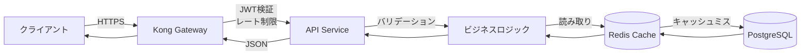
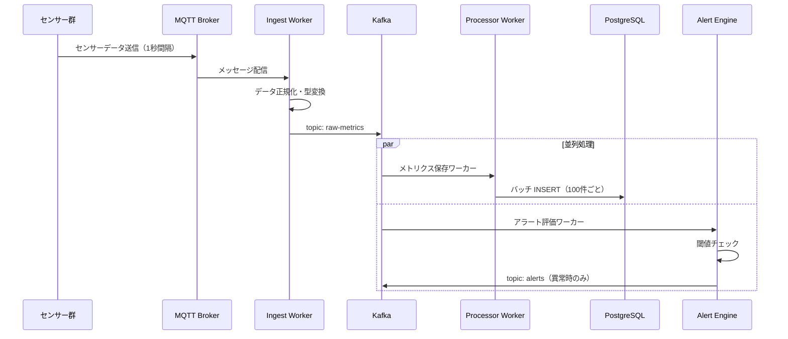
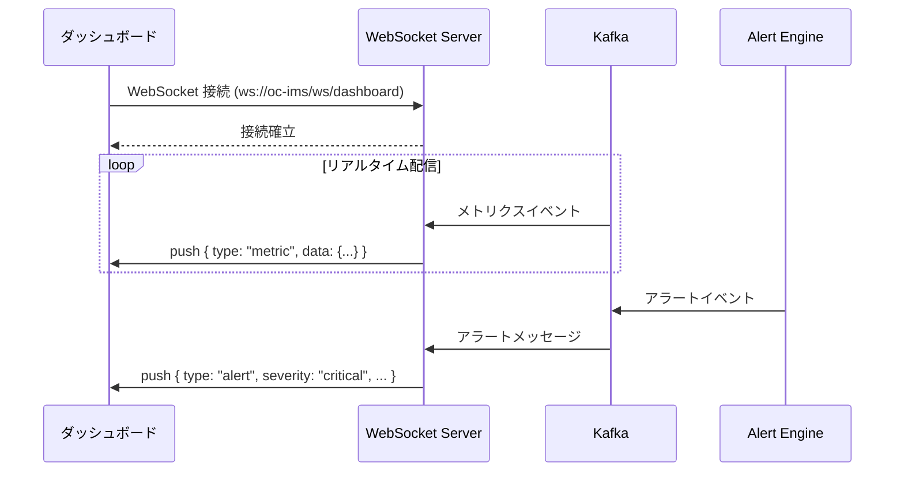

# 1.3.3 処理方式概要

---

## 1. リクエスト処理フロー（同期）



### 処理ステップ詳細

| ステップ | 処理内容 | 担当コンポーネント |
|---|---|---|
| ① 受信 | TLS 終端・リクエスト受付 | Kong Gateway |
| ② 認証 | JWT 署名検証・有効期限確認 | Kong JWT Plugin |
| ③ レート制限 | クライアント単位のスロットリング | Kong Rate-Limiting Plugin |
| ④ ルーティング | サービスへのプロキシ | Kong |
| ⑤ 入力検証 | Pydantic スキーマバリデーション | API Controller |
| ⑥ 認可 | RBAC 権限チェック | Application Service |
| ⑦ ビジネス処理 | ドメインロジック実行 | Domain Service |
| ⑧ データアクセス | DB / キャッシュ読み書き | Repository |
| ⑨ レスポンス整形 | JSON シリアライズ | API Controller |

---

## 2. 非同期処理フロー（センサーデータ取り込み）



---

## 3. キャッシュ戦略

| データ種別 | キャッシュ戦略 | TTL | 更新タイミング |
|---|---|---|---|
| ダッシュボード集計値 | Read-Through | 30秒 | 30秒ごとの定期更新 |
| 閾値設定マスタ | Cache-Aside | 10分 | 設定変更時に即時無効化 |
| ユーザー権限情報 | Cache-Aside | 5分 | ログイン時・権限変更時 |
| アクティブアラート | Write-Through | 1時間 | アラート起票・解除時 |
| センサー最新値 | Write-Through | 10秒 | センサーデータ受信時 |

---

## 4. 大量データのページネーション方式

### Cursor-based Pagination（推奨）

時系列データや大量レコードの取得にはカーソルベースを採用する。

**リクエスト例**
```http
GET /api/v1/metrics?limit=100&cursor=eyJpZCI6MTAwMH0=
```

**レスポンス例**
```json
{
  "data": [ ... ],
  "pagination": {
    "limit": 100,
    "next_cursor": "eyJpZCI6MTEwMH0=",
    "has_more": true
  }
}
```

> オフセットベースページネーションはデータ挿入によるズレが発生するため、リアルタイム監視データには使用しない。

---

## 5. WebSocket によるリアルタイム配信

ダッシュボードへのリアルタイムデータ配信には WebSocket を採用する。


